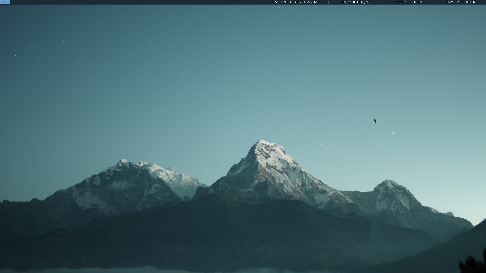
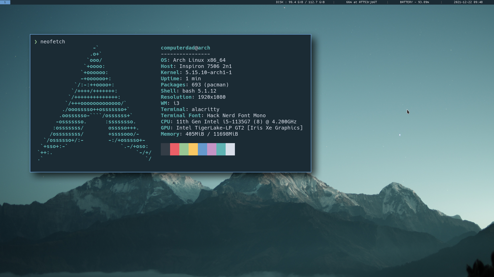
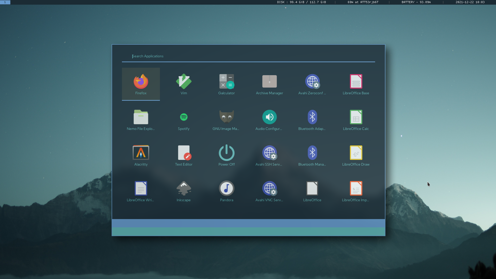
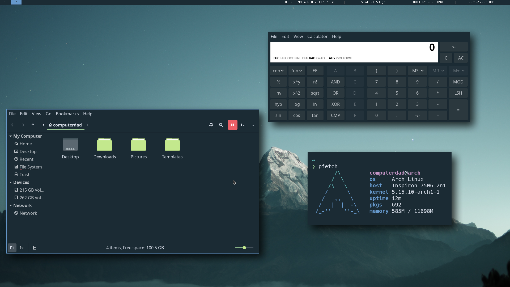
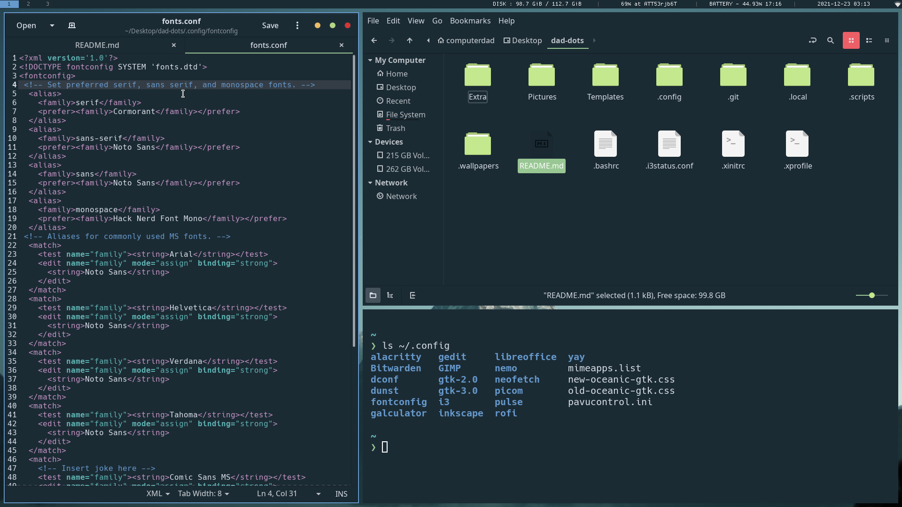
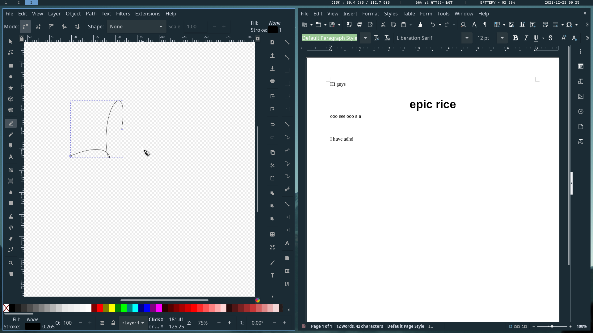
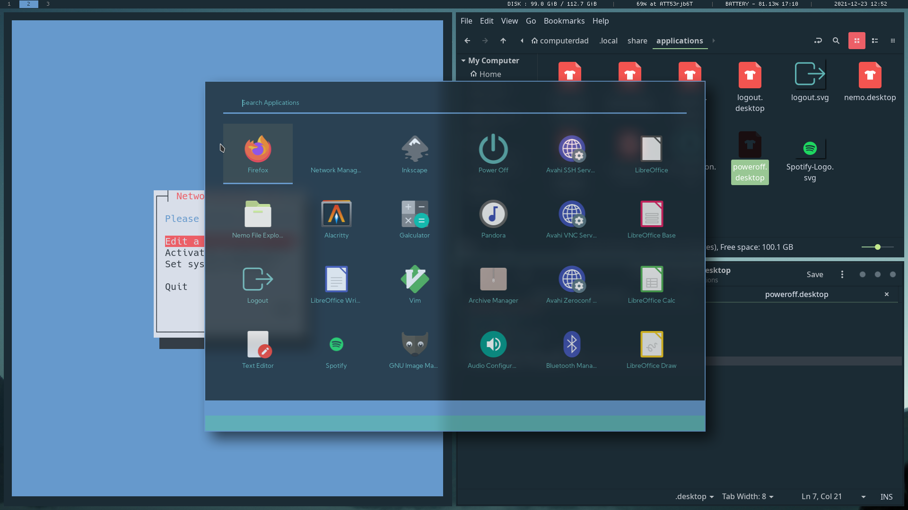

# dad-dots
arch linux rice I made for my dad :)

used https://github.com/dctxmei/rofi-themes

check in the Extra folder for my modified oceanic gtk theme, gedit syntax highlighting theme, lightdm config, and firefox settings















# Programs
```
lightdm (lightdm-gtk-greeter or lightdm-webkit2-greeter with lightdm-webkit2-theme-glorious)
i3-gaps
i3status
xcape
rofi
picom-ibhagwan-git (for no reason.  i literally dont use the rounded corners)
starship
dunst
firefox
spot-client
libreoffice-fresh with breeze icons
feh
nemo
gedit
galculator
```

# Packages
you may need to also install these so stuff works
```
oceanic-gtk-theme
all-repository-fonts
gnome-keyring
nemo-fileroller
```
